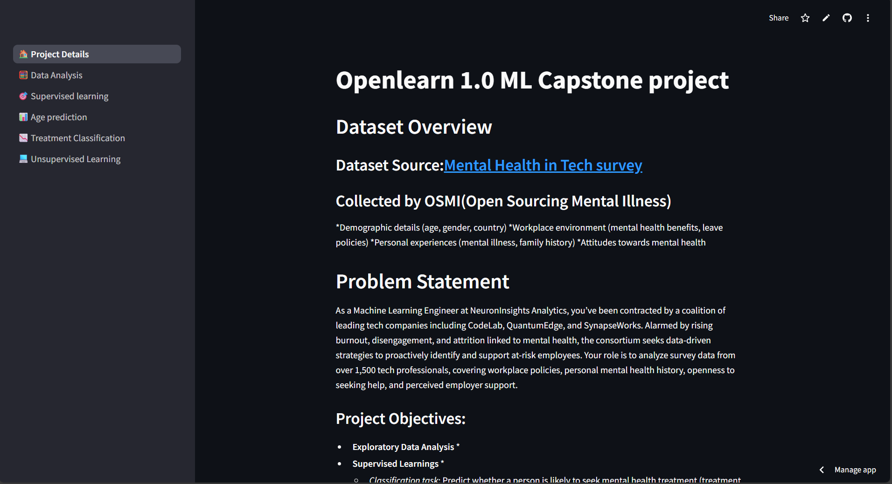
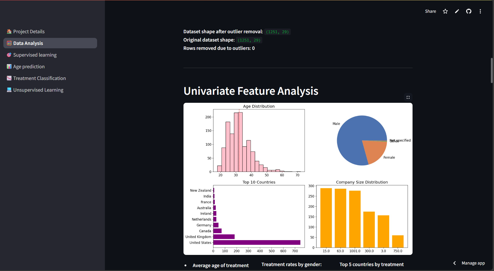
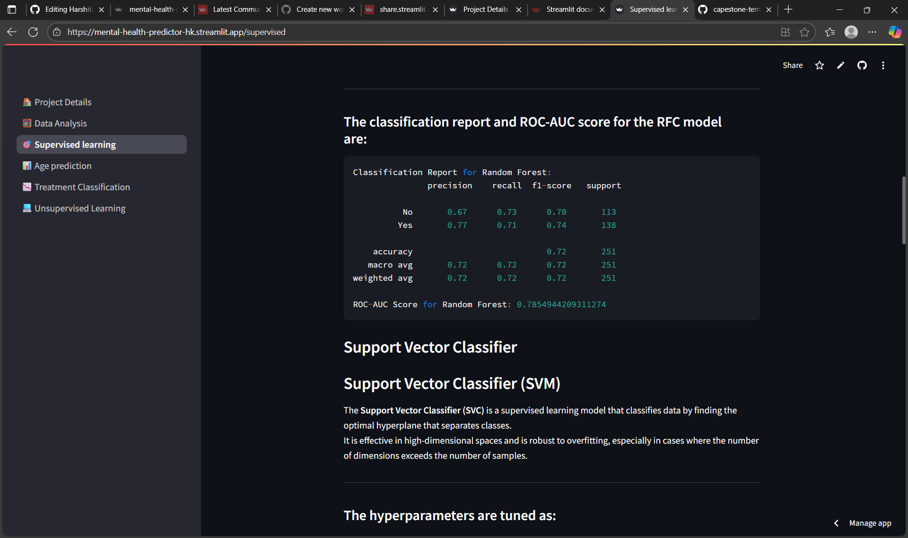

# Harshita-OL-25-LP-046
Capstone Project: Mental Wellness Analysis and Support Strategy Design for the Tech Workforce
# Capstone Project 2025  
**Project Title:** Mental Wellness Analysis and Support Strategy  


---

## 🧾 Student Information  
- **Name:** *Harshita*  
- **Roll No.:** *24111020*  
- **OpenLearn ID (OL ID):** *OL-25-LP-046*  

---

## 📝 Project Description  
This project aims to understand key factors influencing mental health among tech employees and build data-driven solutions for improving workplace well-being. It uses machine learning techniques to perform classification, regression, and clustering tasks and presents results via an interactive Streamlit dashboard.

### **Objectives**
To understand the key factors influencing mental health issues among employees in the tech industry and
build data-driven solutions for:
- **Classification Task:** Predict whether an individual is likely to seek mental health treatment.
- **Regression Task:** Predict the age of an individual based on personal and workplace attributes, supporting age-targeted intervention design.
- **Unsupervised Task:** Segment tech employees into distinct clusters based on mental health indicators to aid in tailored HR policies

---

## 📂 Project Structure  
```
my-streamlit-app/
├─ notebooks/                 # Jupyter notebooks
│   ├─ eda.ipynb
│   ├─ supervised.ipynb
│   └─ unsupervised.ipynb
├─ datasets/                  # All datasets
│   ├─ survey.csv
│   ├─ cleaned_survey1.csv
│   └─ cleaned_survey2.csv
├─ models/                    # Saved ML models
│   ├─ regression_pipeline_log_n.pkl
│   └─ random_forest_pipeline_new1.pkl
├─ images/                    # All image files
│   ├─ univariate1.png
│   ├─ univariate2.jpg
│   └─ ... (all other images)
├─ streamlit_files/           # All Streamlit Python files
│   ├─ app.py
│   ├─ eda1.py
│   ├─ supervised.py
│   ├─ unsupervised.py
│   └─ predict_age.py
|   |__ treatment.py
├─ requirements.txt           # Python packages needed
├─ runtime.txt                # Python version for Streamlit Cloud (optional)
├─ README.md                  # Project description + live app link
└─ .gitignore                 # Ignore unnecessary files like __pycache__, venv, etc.

```

---

## 🔗 Important Links  
- **EDA Notebook:** [https://github.com/harshita485/Harshita-OL-25-LP-046/edit/main/eda.ipynb](#)
- **Supervised Notebook:** [https://github.com/harshita485/Harshita-OL-25-LP-046/edit/main/supervised.ipynb](#)
- **Unsupervised Notebook:** [https://github.com/harshita485/Harshita-OL-25-LP-046/edit/main/unsupervised.ipynb](#)
- **Streamlit App:** [https://mental-health-predictor-hk.streamlit.app/](#)  


## Demo  

Watch the project in action:  

- **Streamlit App Demo:** [https://mental-health-predictor-hk.streamlit.app/](#)  

---

### Screenshots  
- 
- 
-


## Acknowledgements
- Dataset Source: [Mental Health in Tech Survey](https://www.kaggle.com/datasets/osmi/mental-health-in-tech-survey)
- OpenLearn Cohort 1.0 Mentors & Team
